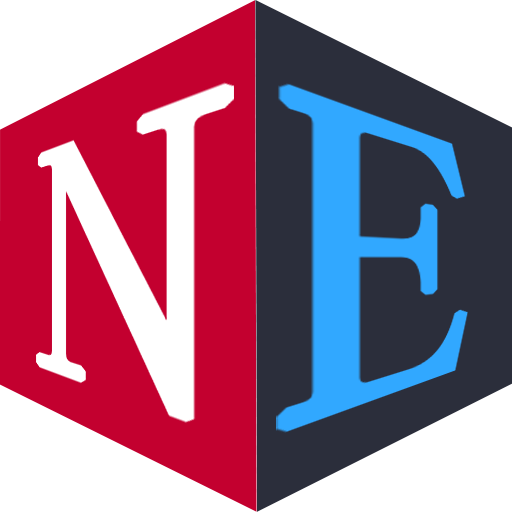

<p align="center">
    
</p>

# NE框架： NestJS + Electron  & Esbuild 

基于[NestJS](https://nestjs.com/)+[Electron](https://www.electronjs.org/)实现的桌面软件开发框架，让开发者能快速搭建一个使用Web技术开发桌面端应用软件的基础环境。

主进程是用esbuild构建的，主程序中集成了NestJS，并且基于NestJS集成了SQLite、LowDB等常用类库，让开发者可以像写NestJS后端一样编写自己的代码。

UI界面使用的Angular并集成了DevUI库，让开发者在编写UI界面时能使用与NestJS相同的语法，感觉这样的编码模式很酷。考虑到开发者的使用习惯，我也会延迟发布For Vue分支，同样集成DevUI库。

编译工具使用了更快速更轻量级的Vite，开发者可以使用“vite build”快速打包发布自己的应用程序。但遗憾的是目前[@angular/cli](https://github.com/angular/angular-cli.git)还未支持Vite，使用For Angular分支需要先"ng"再"vite"。For Vue不会受到影响。

## 快速开始

- 直接克隆此仓库

- For Angular: 
  
  ```bash
  # 安装依赖包
  yarn # npm install
  
  # 运行开发模式
  yarn dev:ng # npm run dev:ng
  yarn dev:ne # npm run dev:ne
  
  # 发布
  yarn build:ng # npm run build:ng
  yarn build:ne # npm run build:ne
  ```
  
- For Vue
  
  ```bash
  # 安装依赖包
  yarn # npm install
  
  # 运行开发模式
  yarn dev # npm run dev
  
  # 发布
  yarn build # npm run build
  ```

## 使用PNPM请注意

与`pnpm`一起使用，你需要调整你的`.npmrc`
```
node-linker=hoisted
```
```
public-hoist-pattern=*
```
```
shamefully-hoist=true
```

